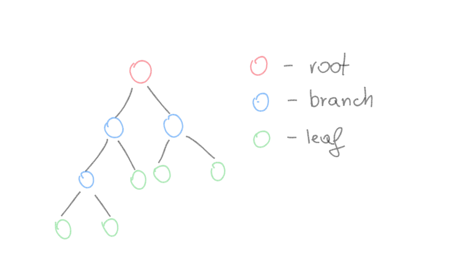
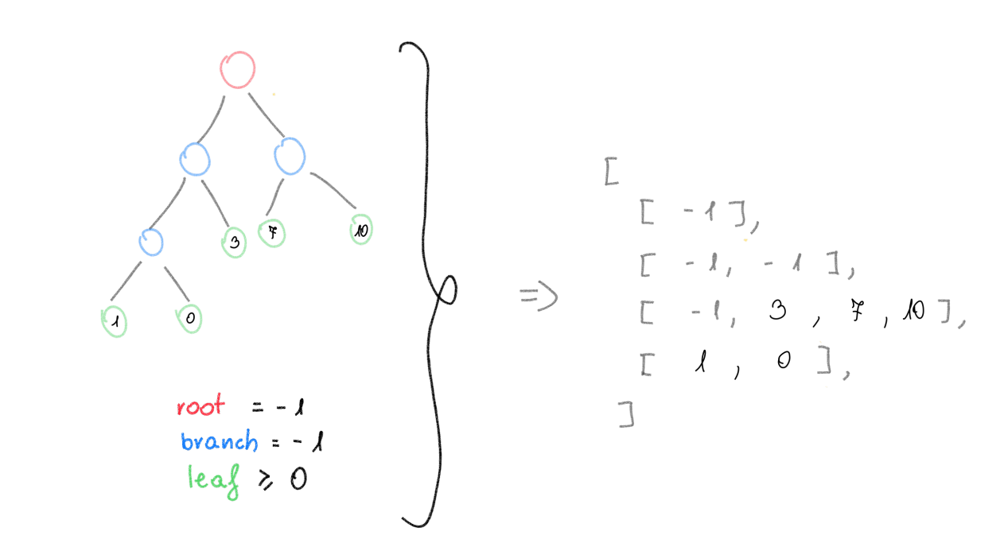
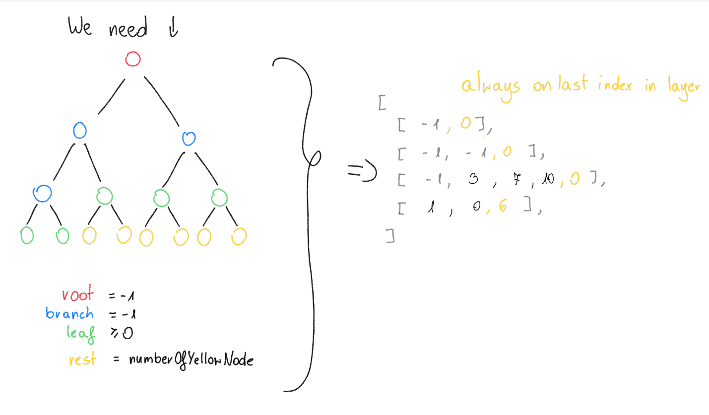

# Documentation for access to decompressor

### Using class is `Controller`

## Passing parametrs

All params should be array of string `String []` \
I use my version of `GetOpt` class where we have `arguemnts` and `options` \
All arguments with their options are listed [bellow](##List-of-arguments) 

### How to use it?
You create array of string.

```
String [] array = {
            "-arg1", "option",
            "-arg2",
            "-arg3", "option"
        };
```

Like you would notice all args starts with '-' char, and it's important. \
If argument have option you should always pass this next to it, or you get error \

## List of arguments

1. `-i` `[../file_patch]` - this param get info about __from__ which file we want to decompress
2. `-o` `[../file_patch]` - this param get info about __to__ which file we want  decompress
3. `-d` `[password]` - if we want to use decrypt function


## List of function

`Controller.getBasicFileData(String [] args);`

This function do two things \
Check file in case it have some tape of error and if it is there return hash map:

```
    [
        "file_status": false,
        "error": [
            "code": integer,
            "message": string,
        ]
    ]
```

`code` - code of error for dev porpouse
`message` - Error message preppared for show to user

Or if whit file is everything alright return:

```
    [
        file_status: true,
        "file_info": [
            "compressed": integer,
            "encrypted": boolean,
            "size": long,
            "file_path": String,
            // "estimated_time_in_secound": long 
        ]
    ]
```

`compressed` - integer value form 0-16, 0 tell that file is not compressed, \
and everything above tell about level of compression \
`encrypted` - if true tell that file is encrypted with password \
`size` - size before decompression \
`estimated_time_in_secound` - tell about time which is need to decompress this file \
// For now last argument is only placeholder, and we do this only if we have enough time

`Controller.getHuffmanTreeAsArray(String [] args);`

This function is to use after we are sure that file is great and don't have any errors. \
If yes this function return nested `ArrayList` class of `Short`. 

On start, we have tree like this \


Next we can save them like this in nested array \


For display porpouse we need to save some more info to recive binary tree \


And this array contains huffman tree in array where we have each of layer and all needed node in it. \
That means that we only have leafs, existing branches, root, \
and on the end of all layer have number of node to have full binary tree 

Array start from root and end on deephest layer.

So we can say is like this:

| Type of node       | Value [Short]                           |
|--------------------|-----------------------------------------|
| root               | -1                                      |
| branch             | -1                                      |
| leaf               | their code from 0 to 2^compressed level |
| last node on layer | number of node to get binary tree       | 

Result tree of our program from example file\


